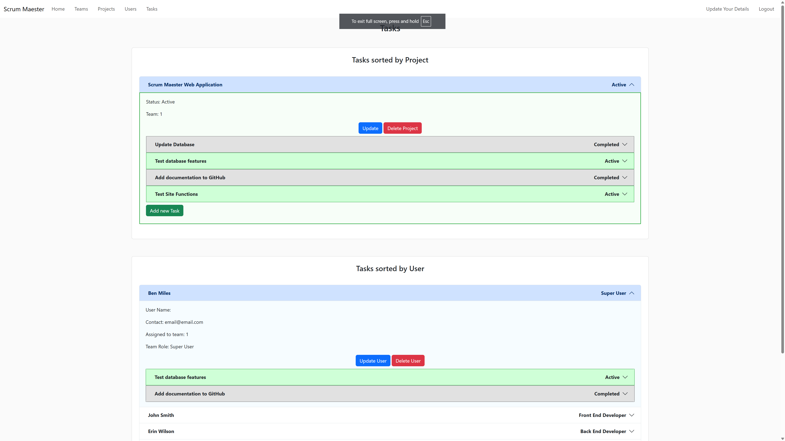

# ScrumMaester

This project is to create a Scrum management system, allowing Scrum masters to better manage coding teams giving better visibility on who is working on what.

[The deployed version of the site is available here](https://scrummaester-81eb70fbef06.herokuapp.com/)

## Project Goals

The goal of this project is to create a versatile Scrum management tool, allowing users of all levels to see at a glance what work has been assigned to them and help manage their workloads. Users should be able to filter data in meaningful ways to help them find the tasks and projects they are looking for quickly and easily. It should also allow Users to edit Teams, Projects and Tasks, so that the data stays relevant to the current state of the project they are working on. Finally, it should allow for deletion of Teams, Projects and Tasks that are no longer relevant, keeping the site clear and easy to navigate.

## Contents

* [User Experience](#user-experience)
    - [User Stories](#user-stories)
* [Design](#design)
    - [Color Scheme](#color-scheme)
    - [Typography](#typography)
    - [Imagery](#imagery)
    - [Wireframe](#wireframe)
    - [Database](#database)
* [Features](#features)
* [Accessibility](#accessibility)
* [Credits](#credits)
* [Technologies Used](#technologies-used)
    - [Languages Used](#languages-used)
    - [Frameworks, Libraries & Programs Used](#frameworks-libraries--programs-used)
* [Deployment and Local Development](#deployment-and-local-development)
    - [Deployment](#deployment)
    - [Local Development](#local-development)
* [Testing](#testing)
    - [Solved Bugs](#solved-bugs)
    - [Known Bugs](#known-bugs)
* [Credits](#credits)
    - [Code Used](#code-used)
    - [Media](#media)
    - [Acknowledgements](#acknowledgements)

## User Experience

### User Stories

**First Time Visitor Goals**

* I want to be able to quickly ascertain the purpose of the site
* I want to be able to register quickly and easily, with no unneccesary complications
* I want the site to be easy to use and responsive to my device
* I want the layout of the site to be intuitive and easy to understand

**Returning Visitor Goals**

* I want to be able to log in quickly and easily
* I want to see content relevant to me on my dashboard
* I want to be able to Create, Update and Delete data easily
* I want to be able to quickly navigate to the information I want to access
* I want the site to be easy to use and responsive to my device

**Frequent Visitor Goals**

* I want to see content relevant to me on my dashboard
* I want to be able to Create, Update and Delete data easily
* I want to be able to quickly navigate to the information I want to access
* I want to be able to filter data in a number of ways to make it easier to follow
* I want the site to be easy to use and responsive to my device

## Design

### Color Scheme

The color palette for this site was mostly chosen by keeping Bootstrap's 'Light' class defaults, as this provided a clean aesthetic that kept out of the way of the rest of the site.

The rest of the site uses two main color themes - Green for Active tasks and projects, and Grey for Completed tasks and projects. This helps users ascertain at a glance the status of Tasks and Projects, making it easier to use.

### Typography

Because the user is working with large volumes of mostly text data I wanted a font family that would be easy to read as well as not providing extra distraction from the content.

I decided to keep the Bootstrap default font family which uses Helvetica and Arial. Both are sans-serif fonts, making them clear and easy to read.

### Imagery

Because of the nature of the site, adding extra imagery seemed like an unnecessary distraction.

As a result I decided not to include any external images to keep the interface focused and easy to read.

### Wireframe

Wireframes were created using Affinity Designer.

**Login**

**Dashboard**

**New Project**

The layout of these designs changed quite significantly during development, as they proved to not be inuitive for the user. Adding more ways to view and manage the data made for an easier way to help users find the data they needed, and allowed multiple points for editing and creating data.

### Database

**Data Map**

Because of the complexity of this project, careful design of the database was needed to ensure it would be able to filter data in meaningful ways for the users.

By creating careful relationships between tables, I was able to create a system that allows users to sort data in a number of ways for their convenience.

**Defensive Design**

During the design of this site it became apparrent that there would need to be a number of defensive design elements to prevent users from making invalid entries or deleting foreign keys that would render the database non-functional. As a result I added some design elements to prevent issues like this occuring:

* *Setting default values for team_id and user_id foreign keys* - This way if a Team or User is deleted, any projects and tasks assigned to them are automatically reassigned to Team 1 and User 1. This allows them to be safely reallocated later, and does not interfere with the integrity of the data.
* *Preventing the deletion of Team 1 and User 1* - Although these entries can be edited, they cannot be deleted. This means that it is not possible to delete the default foreign key values, ensuring the database will function.
* *Populating fields for users when selecting foreign keys* - Rather than users manually inputting foreign key data (which could result in an erroneous value), all foreign keys are selected from values already on the database. This makes it impossible to input values which do not refer to an existing value, preventing issues later down the line.

### Features

**Homepage**

The site has a simple landing page, where users can either log in or register a new account.

**Register**

The registration page allows users to create a new account. This also has validation to ensure that:

* Fields contain data
* Fields do not contain only whitespace
* The inputted Username does not already exist on the database

**Login**

The login page allows users to log into the site, and contains some defensive design elements:

* Accessing site features requires a login, and if users are not logged in they will be redirected to the login page with a message asking them to log in or register

* Entering an incorrect username or password will flash an error message

**Dashboard**

After logging in or performing any task, the site will flash an acknowledgement message

If the user has tasks assigned to them they will be displayed on the dashboard:

But if they have no tasks assigned they will see a notification, inviting them to create a task to get started:

**Teams**

Users can see each Team currently active, with the ability to drill down into Projects sorted by Team and Users sorted by Team.

**Add Team / Update Team**

Clicking on the Add Team button will direct the user to a new page, allowing them to add a team to the database.

Clicking on the Update Team button will direct the user to a new page, allowing them to update an existing team's details. It automatically populates with the existing values, making it easy for users to see what changes they need to make.

On both pages clicking Add Team / Update Team or Cancel will redirect the user back to the last page they visited, allowing them to continue working from where they left off.

**Delete Team**

If a user clicks Delete Team, a modal will pop up checking they wish to proceed

**Projects**

Users can see each Project currently active, with the ability to drill down into Outstanding Tasks and Users assigned to that project.

**Add Project / Update Project**

Clicking on the Add Project button will direct the user to a new page, allowing them to add a project to the database.

Clicking on the Update Project button will direct the user to a new page, allowing them to update an existing project's details. It automatically populates with the existing values, making it easy for users to see what changes they need to make.

On both pages clicking Add Project / Update Project or Cancel will redirect the user back to the last page they visited, allowing them to continue working from where they left off.

**Delete Project**

If a user clicks Delete Project, a modal will pop up checking they wish to proceed

**Users**

Users can see each User currently active, with the ability to drill down into Projects that they are assigned to and Outstanding Projects.

**Update User**

Clicking on the Update User button will direct the user to a new page, allowing them to update an existing user's details. It automatically populates with the existing values, making it easy for users to see what changes they need to make. It also limits the changes to the user's Name, Team Role and Team, preventing them from altering sensitive data like Email or Password.

Clicking Update User or Cancel will redirect the user back to the last page they visited, allowing them to continue working from where they left off.

**Delete User**

If a user clicks Delete User, a modal will pop up checking they wish to proceed

**Tasks**

Users can see each Tasks sorted by Project or by User, allowing them to drill down as required.

**Add Task / Update Task**

Clicking on the Add Task button will direct the user to a new page, allowing them to add a Task to the database.

Clicking on the Update Task button will direct the user to a new page, allowing them to update an existing task's details. It automatically populates with the existing values, making it easy for users to see what changes they need to make.

On both pages clicking Add Task / Update Task or Cancel will redirect the user back to the last page they visited, allowing them to continue working from where they left off.

**Delete Task**

If a user clicks Delete Task, a modal will pop up checking they wish to proceed

**Update Your Details**

This tab allows users to alter their own information, including sensitive information like Email and Password.

**Logout**

This tab logs users out, redirecting them back to the Login page and flashing a message telling them they have logged out successfully.

**404 Page**

The site has a 404 page that displays when the user attempts to navigate to a page that does not exist

**Other Error Pages**

Because this app could be deployed locally on an intranet, I added additional error handling for these error codes:

* 401
* 500
* 502
* 503
* 504

This provides suitable handling for multiple types of environments in case of server errors.

**Future Implementations**

Currently all users can edit all the site data, which is less than ideal. In future implementations I would like to add user permissions based on roles, allowing only Admin users to edit and delete User data to limit the possibility for misuse of the system.

The ability to have a proper team management suite for Team Leader users would also be very useful, allowing different users to interact with the database in ways that best suit their needs.

I would also like to add search functionality to the site, allowing users to search for data and filter it in ways that they can customize according to their needs.

Finally, an archiving facility could also be useful for older projects. So instead of them being deleted entirely projects would instead be archived, allowing Admin users to interrogate this data later as they need.

### Accessibility

I have worked hard to ensure the website is as easy to navigate and as accessible to disabled people as possible. To achieve this I:

- Used semantic HTML elements
- Added Aria tags to all links, buttons and content to ensure Screen Readers are able to comprehend it
- Used a San-Serif font for site navigation, to make it as easy to read as possible
- Ensured contrasting colors were used throughout the site to keep elements easily idenitfiable and readable.

I also tested the site with the Chrome extension [Web Disability Simulator](https://chromewebstore.google.com/detail/web-disability-simulator/olioanlbgbpmdlgjnnampnnlohigkjla) to ensure the user experience was friendly to those with color blindness, parkinsons and dyslexia.

**Yellow-Blue Colorblindness**

**Red-Green Colorblindness**

## Technologies Used

### Languages Used

This site is built using Python, HTML and CSS.

### Frameworks, Libraries & Programs Used

This website is built with Python's [Flask](https://flask.palletsprojects.com/en/stable/) framework. The site data is stored on a [PostgreSQL](https://www.postgresql.org/) database, using [SQLAlchemy](https://www.sqlalchemy.org/) to access the database through Python.

The login and registration forms use [WTForms](https://wtforms.readthedocs.io/en/3.2.x/), and [Bcrypt](https://pypi.org/project/bcrypt/) for password hashing.

I also used [Bootstrap](https://getbootstrap.com/) to provide responsive elements and default classes in HTML.

I used [Visual Studio Code](https://code.visualstudio.com/) for code editing, [pgAdmin](https://www.pgadmin.org/) for database management and [Affinity Designer](https://affinity.serif.com/en-us/designer/) for creating wireframes, mockups and data maps.

## Deployment and Local Development

### Deployment

The site is deployed using Heroku - [The deployed version of the site is available here](https://scrummaester-81eb70fbef06.herokuapp.com/)

**Heroku app setup**

1. From the [Heroku Dashboard](https://dashboard.heroku.com/), click the new button in the top right corner and select create new app.
2. Give your app a name (this must be unique), select the region that is closest to you and then click the create app button bottom left.

**Create the Database**

1. From the [Heroku Dashboard](https://dashboard.heroku.com/), click the name of the web app created in the previous step.
2. Click on the "Resources" tab, then click on the "Find more add-ons" button

3. Scroll through the list of add-ons until you find "Heroku Postgres".

 

4. By clicking on the "Heroku Postgres" add-on, the following page is displayed. Click on the "Install Heroku Postgres" button

5. The next page allows you to select which app to associate the database with. Select the payment plan you wish to use for this app, then click inside the "App to provision to" text box to bring up the drop-down list of apps. Select the app you wish to add the database to.

6. Press the "Submit Order Form" button to connect the database to your app.

7. Return to the app page, where you will see "Heroku Postgres" has been added to your app. Click "Heroku Postgres" to open the database and get the Database Connection Parameters.

8. Click the "Settings" tab

9. Then click "View Credentials"

10. Make note of these credentials, as you will need them to connect to your database.

11. Open pgAdmin

12. Right click "Servers" in the top left corner, then "Register" / "Server"

13. Name your server

14. Click the "connection" tab, entering the details from step 10. Then click "save"

**Restoring the database from backup file**

If you haven't already, download the scrummaester.backup file from the GitHub repo - [BenMilesRocks/3-scrummaester](https://github.com/BenMilesRocks/3-scrummaester).

1. In pgAdmin, navigate to the Heroku database.

2. Open the "Schemas" tab.

3. If a Schema does not currently exist, right click to create a Schema where the data will reside.

4. Right click the Scheme, and select "Restore"

5. Click the folder in the "Filename" section to navigate to the directory where you saved the backup file

6. Click "restore". This should create the tables and populate them with data.

*Please note* The default login for the Super User is Username: user1 , Password: password. This should be changed as soon as possible to prevent security issues.

### Local Development

**How to fork**

To fork the repository:

1. Log in (or sign up) to Github.
2. Go to the repository for this project, [BenMilesRocks/3-scrummaester](https://github.com/BenMilesRocks/3-scrummaester).
3. Click the Fork button in the top right corner.

**How to clone**

To clone the repository:

1. Log in (or sign up) to GitHub.
2. Go to the repository for this project, [BenMilesRocks/3-scrummaester](https://github.com/BenMilesRocks/3-scrummaester).
3. Click on the code button, select whether you would like to clone with HTTPS, SSH or GitHub CLI and copy the link shown.
4. Open the terminal in your code editor and change the current working directory to the location you want to use for the cloned directory.
5. Type 'git clone' into the terminal and then paste the link you copied in step 3. Press enter.
6. Install the packages from the requirements.txt file by running the following command in the terminal:

##
        pip3 install -r requirements.txt

## Testing

Please refer to [testing.md](testing.md) for all testing carried out.

### Solved Bugs

| **No.** | **Bug** | **How I Solved The Issue** |
|:--------|:-------:|:--------------------------:|
| 1 | Input forms accept whitespace in fields | Added Regex to prevent whitespace validation |
| 2 | Textarea Regex stops redirect function from working, redirects user back to add_task or update_task instead. | Added logic to test if redirect would point user to present page, if so directs back to dashboard |
| 3 | Register form does not display existing team info, making it confusing and difficult to know if details are entered correctly | Query Select field, pulling all details from the Teams table for ease of use |
| 4 | Flask pages do not allow for data to be passed back to Python and then back to the page itself, preventing the use of logic to filter data according to user needs | Split each query into a seperate 'Include' statement, allowing data to be filtered in multiple ways and displayed correctly |
| 5 | Password hashing does not save correctly, adding extra characters not recognised by Bycrypt | Passed data to Bcrypt encoded as UTF-8, then decrypts the data back to a string when adding it to the database |
| 6 | Deleting foreign keys is not allowed by the database, as it creates NULL fields | Set default behaviour, assigning defaults to user_id = 1 and team_id = 1 |
| 7 | Deleting team_id 1 or user_id 1 would prevent the default foreign keys from working correctly | Added restrictions preventing deletion of user_id 1 and team_id 1 from the database |

### Known Bugs

The outstanding bugs that I am aware of relate to the Register form. I have tried multiple solutions for these issues, but was not yet able to fully resolve them. These would need resolving in a future version.

| **No.** | **Bug** |
|:--------|:-------:|
| 1 | Register form Regex stops form submission, but does not properly flash message warning user and redirects to the login page |
| 2 | Register form Team Select dropdown does not accept Bootstrap styling, making it visually different from the rest of the site |

## Credits

### Code used

For whitespace validation I used code from this article on [Stack Overflow](https://stackoverflow.com/questions/34974942/regex-for-no-whitespace-at-the-beginning-and-end).

### Media

The instructions for creating a database on Heroku uses images taken from documentation on the [QuizFaber](https://docs.quizfaber.com/4.0/eng/pages/IDH_CLOUD_HEROKU_DB.html) site, and this article on [Medium](https://medium.com/analytics-vidhya/how-to-use-pgadmin-to-connect-to-a-heroku-database-c69b7cbfccd8).

### Acknowledgements

I would like to acknowledge the following people

- Jubril Akolade - my Code Institute mentor

- Ashley Thompson and Raechel Johnson for testing the app

- The Code Institute Slack channel Peer Code Review - thank you to everyone who tested the site and offered feedback