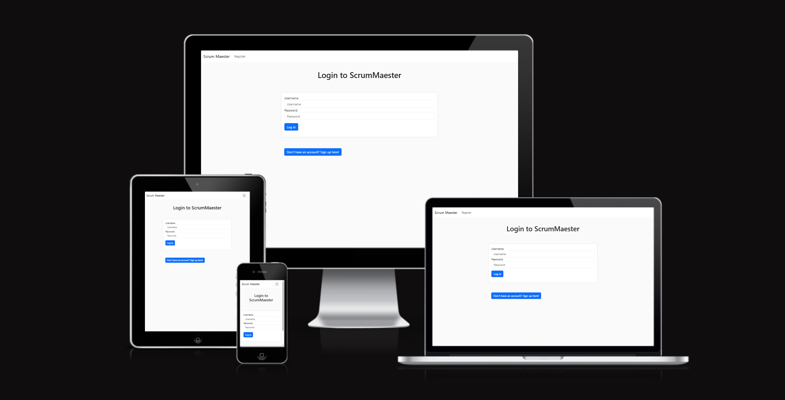
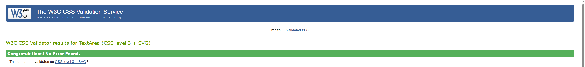
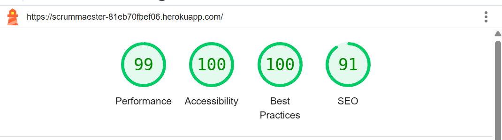
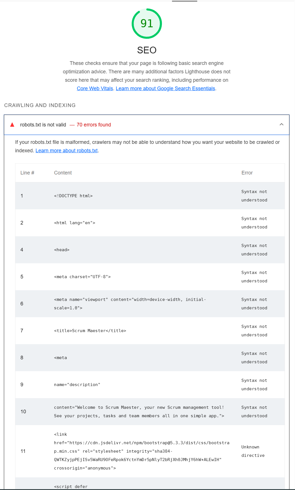

# Scrum Maester -  Testing

Visit the deployed site: [Scrum Maester](https://scrummaester-81eb70fbef06.herokuapp.com/)

- - -

## CONTENTS

* [AUTOMATED TESTING](#automated-testing)
  * [W3C Validator](#w3c-validator)
  * [Lighthouse](#lighthouse)
* [MANUAL TESTING](#manual-testing)
  * [Testing User Stories](#testing-user-stories)
  * [Full Testing](#full-testing)

Testing was ongoing throughout the entire build. I utilised Chrome developer tools whilst building to pinpoint and troubleshoot any issues as I went along.

During development I made use of Google developer tools to ensure everything was working correctly and to assist with troubleshooting when things were not working as expected.

I have gone through each page using Google Chrome developer tools & Microsoft Edge inspector tool to ensure that each page is responsive on a variety of different screen sizes and devices.

- - -

## AUTOMATED TESTING

### W3C Validator

**HTML Validation**

I used [W3C's HTML validator](https://validator.w3.org/) to check my code.

**CSS Validation**

I used [W3C's Jigsaw Validator](https://jigsaw.w3.org/css-validator/) to test my site's CSS, which showed no issues.

- - -

### Lighthouse

I used Lighthouse within the Chrome Developer Tools to test the performance, accessibility, best practices and SEO of the website. The site scored highly across the board:

The only area for improvement was SEO, which showed an issue with the robots.txt file:

This file is configured by Heroku, and is not something I have created.

- - -

## MANUAL TESTING

### Testing User Stories

**First Time Visitors**

| **Goals** | **How are they achieved?** |
| --- | --- |
| I want to be able to quickly ascertain the purpose of the site | Each page uses colour coding and simple design to make it easy for new users to pick up the site functions |
| I want to be able to register quickly and easily, with no unneccesary complications | The registration page is as simple as possible, with each field clearly labled for ease of use |
| I want the site to be responsive to my device | The site uses Bootstrap's default classes to make the site responsive to all device screens |
| I want the layout of the site to be intuitive and easy to understand | All pages are clearly labelled, with color coding to make functions intuitive and clear |

**Returning Visitors**

| **Goals** | **How are they achieved?** |
| --- | --- |
| I want to be able to log in quickly and easily | The login page has clearly labelled fields woth no distractions to make it easy to access |
| I want to see content relevant to me on my dashboard | The dashboard page automatically shows all tasks assigned to the user |
| I want to be able to Create, Update and Delete data easily | All buttons for Creating, Updating and Deleting data are prominently placed and clearly labelled |
| I want to be able to quickly navigate to the information I want to access | Each page is clearly labelled, with data sorted in a variety of ways to make it easy to find |
| I want the site to be responsive to my device | The site uses Bootstrap's default classes to make the site responsive to all device screens |

**Frequent Visitors**

| **Goals** | **How are they achieved?** |
| --- | --- |
| I want to see content relevant to me on my dashboard | The dashboard page automatically shows all tasks assigned to the user |
| I want to be able to Create, Update and Delete data easily | All buttons for Creating, Updating and Deleting data are prominently placed and clearly labelled |
| I want to be able to quickly navigate to the information I want to access | Each page is clearly labelled, with data sorted in a variety of ways to make it easy to find |
| I want to be able to filter data in a number of ways to make it easier to follow | Each page filters data in a variety of ways, allowing users to drill down into the information they need |
| I want the site to be responsive to my device | The site uses Bootstrap's default classes to make the site responsive to all device screens |

- - -

### Full Testing

Full testing was performed on the following devices:

Desktop:
<ul><li>HP Envy All-in-one 32-a10</li></ul>

Mobile Devices:

<ul>
<li>Samsung Galaxy S20 FE</li>
<li>Samsung A20</li>
</ul>

Each device tested the site using the following browsers:

* Google Chrome
* Microsoft Edge
* Firefox

Additional testing was taken by friends and family on a variety of devices and screen sizes. They reported no issues when using the site.

| **Feature** | **Expected Outcome** | **Testing Performed** | **Result** | **Pass/Fail** |
| --- | --- | ---- | --- | --- |
| **Home Page** | --- | --- | --- | --- |
| Login button | Redirect to login.html | Clicked Login button | Redirected to login.html | **PASS** |
| Register button | Redirect to register.html | Clicked Register button | Redirected to register.html | **PASS** |
| Responsive elements | Elements should resize on smaller screens | Resized screen, tested with Chrome Developer tools | Elements resized as expected | **PASS** |
| **Register Page** | --- | --- | --- | --- |
| Input Validation | Page should not accept null values, should display message to warn user | Entered null values on register page | Warning message flashes, asking user to enter details for empty fields | **PASS** |
| Register User | Correctly entered details should create a new user on the database | Entered user details, checked database using PGAdmin | User details created successfully | **PASS** |
| Regex Validation | Whitespace should not be allowed in fields | Entered whitespace in fields, checked database using PGAdmin | User not created in database | **PASS** |
| Log In Nav Bar option | Should redirect to Login.html | Clicked Log In | Redirected to login.html | **PASS** |
| 'Already have an account?' button | Should redirect to Login.html | Clicked 'Already have an account?' button | Redirected to login.html | **PASS** |
| Password Hashing | Created passwords should be hashed on the database for security | Registered user with password, checked database using PGAdmin | Password successfully hashed | **PASS** |
| **Login Page** | --- | --- | --- | --- |
| Input validation | Should flash message if field empty, incorrect username, incorrect password | Tried entering empty fields, incorrect username, incorrect password | Did not log in, error message flashed as expected | **PASS** |
| Log in | Correct details should log in user, redirect to dashboard.html | Logged in with user details | Logged in, redirected to dashboard.html | **PASS** |
| Register Nav Bar option | Should redirect to register.html | Clicked Register | Redirected to register.html | **PASS** |
| 'Don't have an account?' button | Should redirect to register.html | Clicked 'Don't have an account?' button | Redirected to register.html | **PASS** |
| **Navbar** | --- | --- | --- | --- |
| Navbar Links | Hovering over links should highlight each one, clicking links should redirect to each page | Hovered over links, clicked links | Hovering over links highlights each one, clicking links redirects to the associated page | **PASS** |
| Logout button | Should log user out, redirect to login.html, flash 'Successfully Logged Out!' message | Clicked Logout button | Logged user out, redirected to login.html, flashed 'Successfully Logged Out!' message | **PASS** |
| **Dashboard Page** | --- | --- | --- | --- |
| Log In flash message | The message "Successfully Logged In!" should be flashed at the top of the screen, which should be dismissed by clicking the 'X' button or navigating away | Logged in with user credentials | Message flashed as expected, message dismissed by clicking 'X' button | **PASS** |
| 'No Tasks Assigned!' message | Users with no tasks assigned should see a message, inviting them to create a new task | Logged in with a user who had no tasks assigned | Message displayed as expected | **PASS** |
| 'No Tasks Assigned!' add task button | Button should navigate to add_task.html | Clicked button | navigated to add_task.html | **PASS** |
| Assigned tasks | Tasks assigned to the user should display on the Dashboard | Logged in with a user who had tasks assigned  | Tasks displayed correctly | **PASS** |
| Update Task button | Should redirect to update_task.html with the task details populated | Clicked Update Task button | Redirected to update_task.html with the correct task details populated | **PASS** |
| Delete Task button | Should open modal, checking user wants to delete the task. Clicking 'Go Back To Safety' should close the modal, clicking 'Delete Task' should delete the task. | Clicked Delete Task button, clicked 'Go Back to Safety' and 'Delete Task' inside the Modal. | Modal opened correctly, closed when clicking 'Go Back to Safety', 'Delete Task' deleted the task from the database | **PASS** |
| **Teams Page** | --- | --- | --- | --- |
| Team Cards | Should dynamically create a card for each team, displaying Team Lead & Contact details as well as accordions for Projects & Team Members | Opened teams.html | Cards for each team created correctly | **PASS** |
| Update Team | Should redirect to update_team.html, with the details for the selected team | Clicked Update Team | Redirected to update_team.html, displaying the correct team details | **PASS** |
| Delete Team button | Should open modal, checking user wants to delete the team. Clicking 'Go Back To Safety' should close the modal, clicking 'Delete Team' should delete the team. | Clicked Delete Team button, clicked 'Go Back to Safety' and 'Delete Team' inside the Modal. | Modal opened correctly, closed when clicking 'Go Back to Safety', 'Delete Team' deleted the team from the database | **PASS** |
| Projects Accordion | Should expand the project_by_team accordion, display all projects assigned to this team. | Clicked Projects accordion | Expands the project_by_team accordion, displays all projects associated to this team | **PASS** |
| Add new Task button (inside Project accordion) | Should redirect to add_task.html | Clicked Add new Task | Redirected to add_task.html | **PASS** |
| Update Project (inside Project accordion) | Should redirect to update_project.html | Clicked Update Project | Redirected to update_project.html | **PASS** |
| Delete Project (inside Project accordion) | Should open modal, checking user wants to delete the Project. Clicking 'Go Back To Safety' should close the modal, clicking 'Delete Project' should delete the project. | Clicked Delete Project button, clicked 'Go Back to Safety' and 'Delete Project' inside the Modal. | Opened modal correctly, 'Go Back to Safety' closed modal, 'Delete Project' deleted project correctly | **PASS** |
| Add New Project | Should redirect to add_project.html | Clicked Add New Project | Redirected to add_project.html | **PASS** |
| Project_by_team accordion | Each project should extend in its own accordion, displaying tasks assigned to this project | Clicked individual project accordion | Extends project info, displays tasks assigned to this project | **PASS** |
| Task_by_project | Each task should extend in its own accordion, displaying task details | Clicked task_by_project accordion | Extends accordion, displayed task details | **PASS** |
| Add New Task (inside task_by_project accordion) | Should redirect to add_task.html | Clicked Add New Task | Redirected to add_task.html | **PASS** |
| Update Task (inside task_by_project accordion) | Should redirect to update_task.html | Clicked Update Project | Redirected to update_task.html | **PASS** |
| Delete Task (inside task_by_project accordion) | Should open modal, checking user wants to delete the Task. Clicking 'Go Back To Safety' should close the modal, clicking 'Delete Task' should delete the task. | Clicked Delete Task | Opened modal correctly, 'Go Back to Safety' closed modal, 'Delete Task' deleted task correctly | **PASS** |
| Team Members accordion | Should display accordions for each member of the team | Clicked Team Members accordion | Displayed accordions for each team member correctly | **PASS** |
| User accordion | Should expand accordion displaying details of team member and accordions for tasks assigned to them | Clicked User accordion | Expanded user accordion, displayed user details and tasks correctly | **PASS** |
| Update User (inside user accordion) | Should redirect to update_user.html | Clicked Update User | Redirects to update_user.html, displays correct user details | **PASS** |
| Delete User (inside user accordion) | Should open modal, checking user wants to delete the User. Clicking 'Go Back To Safety' should close the modal, clicking 'Delete User' should delete the user. | Clicked Delete User | Opened modal correctly, 'Go Back to Safety' closed modal, 'Delete User' deleted user correctly | **PASS** |
| Add New Team | Should redirect to add_team.html | Clicked Add New Team | Redirects to add_team.html | **PASS** |
| **Projects Page** | --- | --- | --- | --- |
| Project Cards | Each project should display as its own card, displaying project details, team info and accordions for Outstanding Tasks and Team Members | Opened projects.html | Project cards displayed correctly | **PASS** |
| Outstanding Tasks accordion | Should open an accordion displaying all active tasks assigned to the project | Clicked Outstanding Tasks accordion button | Accordion opened, displaying all active tasks for project | **PASS** |
| Add New Task | Should redirect to add_task.html | Clicked Add New Task | Redirected to add_task.html | **PASS** |
| Task Accordion (inside Outstanding Tasks) | Should open another accordion displaying the details of the task | Clicked Task Accordion | Opened task accordion, displayng details of the task correctly | **PASS** |
| Update Task (inside Task Accordion) | Should redirect to update_task.html, displaying details of the relevant task | Clicked Update Task | Redirected to update_task.html, displayed task details correctly | **PASS** |
| Delete Task (inside Task Accordion) | Should open modal, checking user wants to delete the Task. Clicking 'Go Back To Safety' should close the modal, clicking 'Delete Task' should delete the task. | Clicked Delete Task | Opened modal correctly, 'Go Back to Safety' closed modal, 'Delete Task' deleted task correctly | **PASS** |
| Team Members Accordion | Should open an accordion displaying all Users assigned to the Project Team, each with their own accordion. | Clicked Team Members accordion. | Opens accordion, displaying User accordions correctly. | **PASS** |
| User Accordion (inside Team Members accordion) | Should display details of the user, with accordions for tasks assigned to them relevant to this project | Clicked User Accordion | Displayed user details correctly, displayed accordions for tasks assigned to this project | **PASS** |
| Update User (inside User Accordion) | Should redirect to update_user.html, displaying the correct user details | Clicked Update User | Redirects to update_user.html, displayed user details correctly | **PASS** |
| Delete User (inside user accordion) | Should open modal, checking user wants to delete the User. Clicking 'Go Back To Safety' should close the modal, clicking 'Delete User' should delete the user. | Clicked Delete User | Opened modal correctly, 'Go Back to Safety' closed modal, 'Delete User' deleted user correctly | **PASS** |
| Task Accordion (inside User Accordion) | Should expand accordion and display Task details | Clicked Task Accordion | Expanded accorion, task displayed correctly | **PASS** |
| Update Task (inside Task Accordion) | Should redirect to update_task.html | Clicked Update Project | Redirected to update_task.html | **PASS** |
| Delete Task (inside Task Accordion) | Should open modal, checking user wants to delete the Task. Clicking 'Go Back To Safety' should close the modal, clicking 'Delete Task' should delete the task. | Clicked Delete Task | Opened modal correctly, 'Go Back to Safety' closed modal, 'Delete Task' deleted task correctly | **PASS** |
| **Users Page** | --- | --- | --- | --- |
| User Cards | Should display all users, each card displaying the user details with accordions for Projects and Outstanding Tasks | Opened users.html | Displayed all users correctly, each card displaying user details and accordions for Projects and Outstanding Tasks | **PASS** |
| Update User | Should redirect to update_user.html, displaying user details | Clicked Update User | Redirects to update_user.html, displayed user details correctly | **PASS** |
| Delete User | Should open modal, checking user wants to delete the User. Clicking 'Go Back To Safety' should close the modal, clicking 'Delete User' should delete the user. | Clicked Delete User | Opened modal correctly, 'Go Back to Safety' closed modal, 'Delete User' deleted user correctly | **PASS** |
| Projects accordion | Should open accordion, displaying all projects assigned to user's team_id | Clicked Projects accordion | Opens accordion, displaying all projects assigned to user's team_id | **PASS** |
| Update Project (inside Projects accordion) | Should redirect to update_project.html | Clicked Update Project | Redirected to update_project.html | **PASS** |
| Delete Project (inside Projects accordion) | Should open modal, checking user wants to delete the Project. Clicking 'Go Back To Safety' should close the modal, clicking 'Delete Project' should delete the project. | Clicked Delete Project button, clicked 'Go Back to Safety' and 'Delete Project' inside the Modal. | Opened modal correctly, 'Go Back to Safety' closed modal, 'Delete Project' deleted project correctly | **PASS** |
| Task Accordion (inside Projects accordion) | Should open an accordion for tasks assigned to this user in this project, displaying details of the task | Clicked Task Accordion | Opens accordion for tasks assigned to this user in this project, displays details of the task correctly | **PASS** |
| Update Task (inside Task Accordion) | Should redirect to update_task.html | Clicked Update Project | Redirected to update_task.html | **PASS** |
| Delete Task (inside Task Accordion) | Should open modal, checking user wants to delete the Task. Clicking 'Go Back To Safety' should close the modal, clicking 'Delete Task' should delete the task. | Clicked Delete Task | Opened modal correctly, 'Go Back to Safety' closed modal, 'Delete Task' deleted task correctly | **PASS** |
| **Tasks Page** | --- | --- | --- | --- |
| Tasks sorted by Project | Should display accordions for each project, opening to display project details | Opened tasks.html | Project accordions displayed correctly, opened when clicked | **PASS** |
| Update Project (inside Project accordion) | Should redirect to update_project.html | Clicked Update Project | Redirected to update_project.html | **PASS** |
| Delete Project (inside Project accordion) | Should open modal, checking user wants to delete the Project. Clicking 'Go Back To Safety' should close the modal, clicking 'Delete Project' should delete the project. | Clicked Delete Project button, clicked 'Go Back to Safety' and 'Delete Project' inside the Modal. | Opened modal correctly, 'Go Back to Safety' closed modal, 'Delete Project' deleted project correctly | **PASS** |
| Task accordions (inside Project accordion) | Should open accordion, displaying task details | Clicked Task accordion | Opens accordion, displays task details correctly | **PASS** |
| Update Task (inside Task Accordion) | Should redirect to update_task.html | Clicked Update Project | Redirected to update_task.html | **PASS** |
| Delete Task (inside Task Accordion) | Should open modal, checking user wants to delete the Task. Clicking 'Go Back To Safety' should close the modal, clicking 'Delete Task' should delete the task. | Clicked Delete Task | Opened modal correctly, 'Go Back to Safety' closed modal, 'Delete Task' deleted task correctly | **PASS** |
| Add New Task (inside project accordion) | Should redirect to add_task.html | Clicked Add New Team | Redirects to add_task.html | **PASS** |
| Tasks sorted by User | Should display accordions for each user, opening to display tasks assigned to each user | Opened tasks.html | User accordions displayed correctly, opened when clicked | **PASS** |
| Update User | Should redirect to update_user.html, displaying user details | Clicked Update User | Redirects to update_user.html, displayed user details correctly | **PASS** |
| Delete User | Should open modal, checking user wants to delete the User. Clicking 'Go Back To Safety' should close the modal, clicking 'Delete User' should delete the user. | Clicked Delete User | Opened modal correctly, 'Go Back to Safety' closed modal, 'Delete User' deleted user correctly | **PASS** |
| Task accordion (inside User accordion) | Should open task accordion, displaying task details | Clicked task accordion | Task accordion opened, displayed task details correctly | **PASS** |
| Update Task (inside Task Accordion) | Should redirect to update_task.html | Clicked Update Project | Redirected to update_task.html | **PASS** |
| Delete Task (inside Task Accordion) | Should open modal, checking user wants to delete the Task. Clicking 'Go Back To Safety' should close the modal, clicking 'Delete Task' should delete the task. | Clicked Delete Task | Opened modal correctly, 'Go Back to Safety' closed modal, 'Delete Task' deleted task correctly | **PASS** |
| Add New Task (bottom of page) | Should redirect to add_task.html | Clicked Add New Team | Redirects to add_task.html | **PASS** |
| **Add Task Page** | --- | --- | --- | --- |
| Field Validation | Should prevent submitting invalid content | Tried submitting form with empty fields | Flashed message, asking for form to be filled out | **PASS** |
| Regex Validation | Should flash message if whitespace submitted on Task Description, should not add task to database | Entered whitespace on Task Description | Flashed error message, did not add task to database | **PASS** |
| Cancel Button | Should not create task, should redirect to last page visited | Clicked Cancel button | No task created, redirected to last page visited | **PASS** |
| Add Task Button | Should create database entry on submission, should redirect to last page visited | Entered task details, clicked Add Task | Created database entry as expected, redirected to last page visited | **PASS** |
| **Update Task Page** | --- | --- | --- | --- |
| Display Task details | Should display the details of the Task selected | Clicked Update Task | Task details displayed correctly | **PASS** |
| Field Validation | Should prevent submitting invalid content | Tried submitting form with empty fields | Flashed message, asking for form to be filled out | **PASS** |
| Regex Validation | Should flash message if whitespace submitted on Task Description, should not add task to database | Entered whitespace on Task Description | Flashed error message, did not add task to database | **PASS** |
| Cancel Button | Should not update task, should redirect to last page visited | Clicked Cancel button | No task updated, redirected to last page visited | **PASS** |
| Update Task Button | Should update database entry on submission, should redirect to last page visited | Entered task details, clicked Update Task | Updated database entry as expected, redirected to last page visited | **PASS** |
| **Add Project Page** | --- | --- | --- | --- |
| Field Validation | Should prevent submitting invalid content | Tried submitting form with empty fields | Flashed message, asking for form to be filled out | **PASS** |
| Cancel Button | Should not create project, should redirect to last page visited | Clicked Cancel button | No project created, redirected to last page visited | **PASS** |
| Add Project Button | Should create database entry on submission, should redirect to last page visited | Entered project details, clicked Add Project | Created database entry as expected, redirected to last page visited | **PASS** |
| **Update Project Page** | --- | --- | --- | --- |
| Display Project details | Should display the details of the Project selected | Clicked Update Project | Project details displayed correctly | **PASS** |
| Field Validation | Should prevent submitting invalid content | Tried submitting form with empty fields | Flashed message, asking for form to be filled out | **PASS** |
| Cancel Button | Should not update project, should redirect to last page visited | Clicked Cancel button | No project updated, redirected to last page visited | **PASS** |
| Update Project Button | Should update database entry on submission, should redirect to last page visited | Entered project details, clicked Update Project | Updated database entry as expected, redirected to last page visited | **PASS** |
| **Add Team Page** | --- | --- | --- | --- |
| Field Validation | Should prevent submitting invalid content | Tried submitting form with empty fields | Flashed message, asking for form to be filled out | **PASS** |
| Cancel Button | Should not create team, should redirect to last page visited | Clicked Cancel button | No team created, redirected to last page visited | **PASS** |
| Add Team Button | Should create database entry on submission, should redirect to last page visited | Entered team details, clicked Add Team | Created database entry as expected, redirected to last page visited | **PASS** |
| **Update Team Page** | --- | --- | --- | --- |
| Display Team details | Should display the details of the Team selected | Clicked Update Team | Team details displayed correctly | **PASS** |
| Field Validation | Should prevent submitting invalid content | Tried submitting form with empty fields | Flashed message, asking for form to be filled out | **PASS** |
| Cancel Button | Should not update team, should redirect to last page visited | Clicked Cancel button | No team updated, redirected to last page visited | **PASS** |
| Update Team Button | Should update database entry on submission, should redirect to last page visited | Entered team details, clicked Update Team | Updated database entry as expected, redirected to last page visited | **PASS** |
| **Update User Page** | --- | --- | --- | --- |
| Display User details | Should display user information | Clicked update user | User info displayed correctly | **PASS** |
| Field Validation | Should prevent submitting invalid content | Tried submitting form with empty fields | Flashed message, asking for form to be filled out | **PASS** |
| Cancel Button | Should not update user, should redirect to last page visited | Clicked Cancel button | No user updated, redirected to last page visited | **PASS** |
| Update User Button | Should update database entry on submission, should redirect to last page visited | Entered user details, clicked Update User | Updated database entry as expected, redirected to last page visited | **PASS** |
| **Update Your Details Page** | --- | --- | --- | --- |
| Display User details | Should display user information for logged in user | Clicked update user | User info displayed correctly | **PASS** |
| Field Validation | Should prevent submitting invalid content | Tried submitting form with empty fields | Flashed message, asking for form to be filled out | **PASS** |
| Cancel Button | Should not update user, should redirect to last page visited | Clicked Cancel button | No user updated, redirected to last page visited | **PASS** |
| Update User Button | Should update database entry on submission, should redirect to last page visited | Entered user details, clicked Update User | Updated database entry as expected, redirected to last page visited | **PASS** |
| **Logout** | --- | --- | --- | --- |
| Logout button | Should log user out, redirect to login.html & flash message "Successfully Logged Out!" | Clicked Logout button | Logged user out, redirected to login.html & flashed message "Successfully Logged Out!" | **PASS** |
| Login required | Entering url for pages other than index, login and register should prevent the user from accessing the site | Manually typed url for Dashboard, Projects, Tasks, Users | Redirected to login.html, message flashed "Please log in to access this page" | **PASS** |

- - -